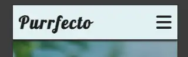
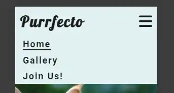
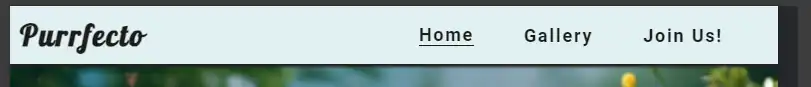
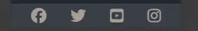
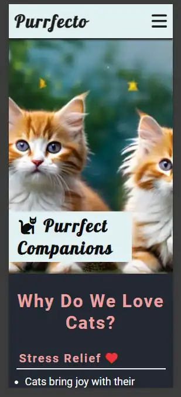
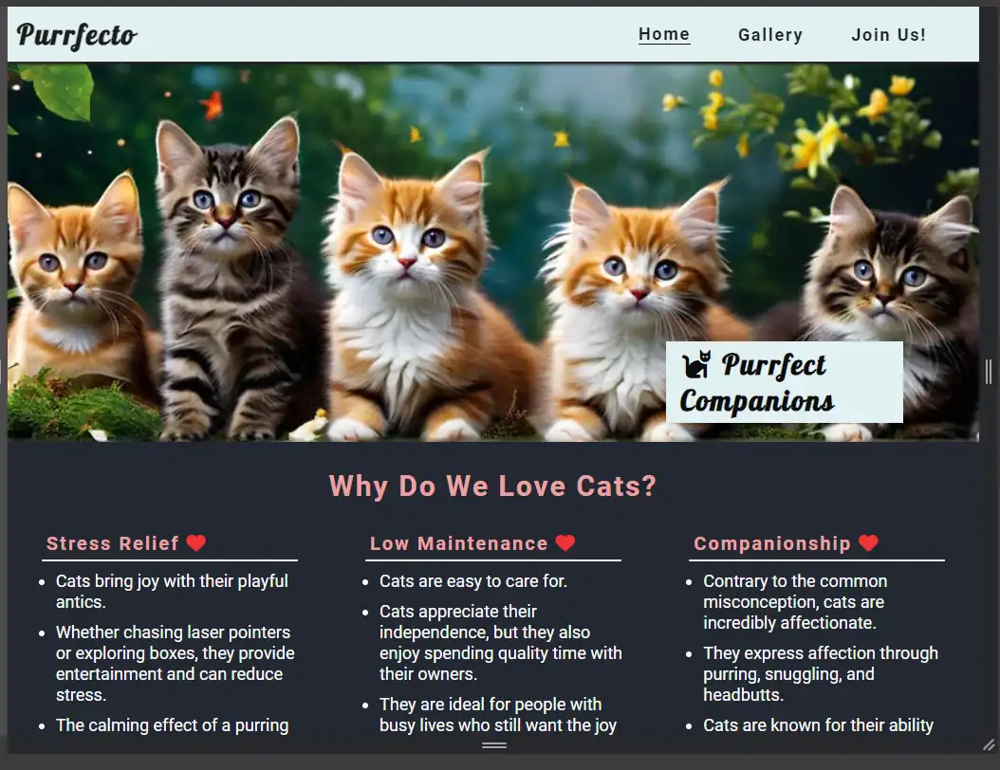
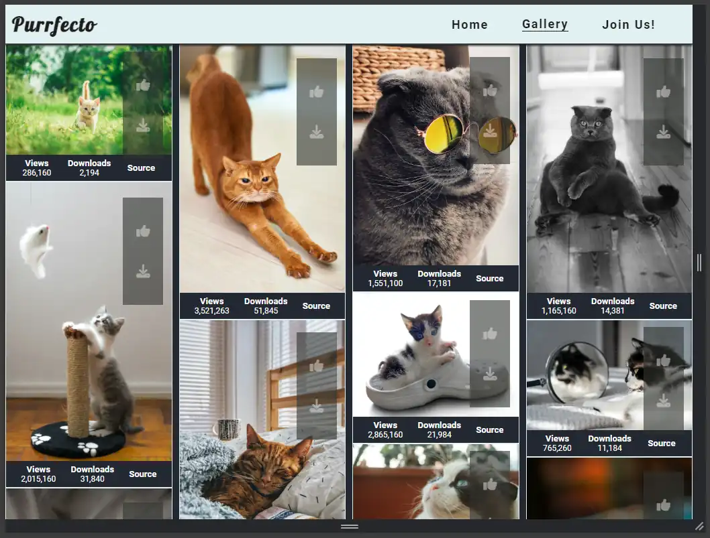
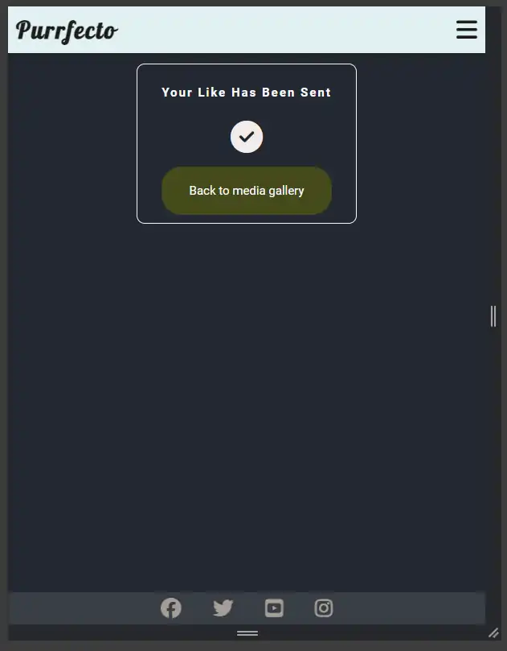
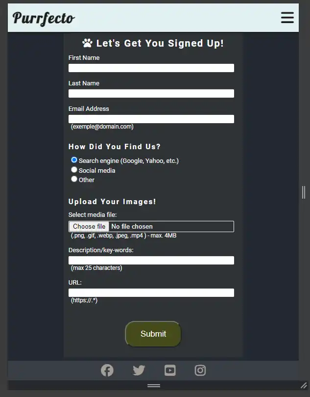
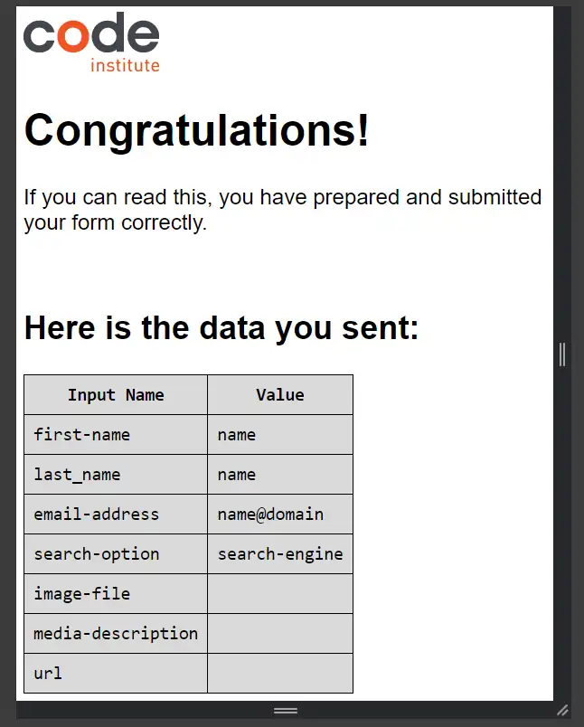

# Welcome to Purrfecto - the hub where cat lovers unite!
Purrfecto is an online hub where cat lovers (and not only) can share and enjoy images (and possibly videos) of their beloved feline friends. 
The site aims to helping people of all ages across the world to connect and build-up a vibrant community.

## Project structure
The project structure is as follows:  
- index.html
- gallery.html
- contact.html
- likes.html
- assets folder
    - css folder
        - style.css
    - favicon folder
    - images folder
        - cats folder containing images of cats
        - readme-views containing screen shots for various website components

## Main features
The site has a standard structure with three content (Home, Gallery and Join Us!) corresponding to index.hmtl, gallery.html and contact.html files in the project. 
Additionaly, the site has a confirmation page (see the Join-Us section below) associated to the likes.html file. 

All pages share a few common features such as:
* Navigation bar 
    - Fully responsive and identical on each page
    - Contains the Logo (Purrfecto)
        - The Logo is combination of two words - 'purr' and 'perfect', with an Italian spin.
    - A reponsive menu
        - The menu is compact on small displays and fully visible on larger ones    
        - The name of the active page is uderlined in the menu bar
        - The page names scale up when hovering over them while the cursor changes to pointer-style  
    - Includes links to the Logo as well as to the Home, Gallery and Join-Us pages 
    
    
     

  * Footer
    - Consistent on each page   
    - Contains icons/links to some of the major media-platforms (Facebook, Twitter, YouTube and Instagram)
        - The provided links open in new tabs
        - When hovering, the icons scale up and change the opacity
       

### Home page
The Home page is page is fully responsive and contains the following sections: 
- Hero section:
    - Includes an eye-catching and soul-melting AI-generated image of kittens
    - the 'Purrfecto' - logo is overlayed over the landing image.
    
    
- Additional content section:
    - Includes four articles that presents general facts about cats formatted as unordered lists
    - The text content for the articles was generated using ChatGPT
    - Call to action section provides a link to the image gallery page, and portraits an AI-generated collage of cats as a preview
- The map section: 
    - contains an embedded Google map of the Ainoshima island in Japan which is pretty famous for its stray cat population. A link to a dedicated Wikipedia article is also provided

### Gallery page
- The Gallery page contains media content in form of images uploaded by the users.
- All the images were downloaded from unsplash.com in .jpeg format and post-processed using the GIMP-software to reduce their sizes (in MB) and convert to .webp format.  
- The media files are inserted into reusable card objects that provide statistics functionality such as send-likes and download options. 
    - The statistics (number of views and downloads) will be further used for ranking the content.
- The page uses a masonry layout to create visually pleasent display of cards of different extents.
- The cards can contain either images and can be easily adjusted for video material.  
      

- After sending a like by clicking on the icon embedded in the figure, a confirmation massage is provided in the likes.html page that opens in a new tab  where the user has the option to navigate back to the gallery page.  
  

### Join Us page
- The page contains a form providing the users with the options for registering to the hub via name and a valid email address. 
    - The name fields are required to be filled in
    - Providing a valid email adress is mandatory for registration. 
- A group of radio buttons has been included in the form for retrieveing information on how people are finding the website, either from media platforms, personal contacts or via other channels. 
    - The survey will help optimizing the media marketing.
- Functionality for uploading media files is also provided with certain restrictions
    - The hub accepts only image files in .png, .webp, .jpeg or .gif formats, and .mp4 video files
    - All files are required to have max 4MB in size
    - Users can provide a short description of maximum 25 characters for the content to be uploaded
    - It is also possible to provide the URL for the source of the uploaded material, such as personal websites or posts on other media plaforms   
- Uploading media files is not mandatory for registration    
- After submitting the regsitration form, a confirmation massage is provided in the likes.html page that opens in a new tab  where the user has the option to navigate back to the gallery page.  
     

### Styling
- The CSS styling is provided in the style.css file.
- The stying overrides the default styles added by the browser, and the default value of the root font-size is converted from 16 to 10 px to facilitate the use of base 10 for measurement unit calculations when using rem. 
- I tried to write reusable code by defining CSS classes that can accomodate several situations, yet the code became quite large and difficult to follow.  
- The website uses the Roboto and Lobster font families imported from Google fonts. The Lobster is used for the Hero-section, while the text in the main content uses Roboto.    

## Testing and validation
- The website was tested on Chrome, Brave and Edge web browsers on a Windows 11 PC, as well as on an Android system (Samsung Galaxy S21 mobile phone), and no issues were noticed.
- The .html and .css files were checked using the validator available at https://validator.w3.org/nu/ via direct text input, and apparently no errors nor warnings were found.
- For all pages, the color contrast was checked using the tools provided by https://coolors.co/, and all the results were at least very good 

## Unfixed Bugs:
- email validation: fails to check for valid domain. I tried to use the regex syntax according to https://regexr.com/, but is still possible to submit an email without a valid domain (for instance, name@domain is allowed)
- the uploading of the Gallery page is rather slow, despite using the lazy-loading attribute for each of the images.
 

 ## TODO list
 - Add more general info about cats
 - Card objects for Video files
 - Video gallery page
 - Blog section
  
## Credits
- The favicon for the website was generated from text using the https://favicon.io/ tools. 
- All the other icons were obtained from fontawesome.com
- The AI-images were generated using the free-tier functionality provided by https://playground.ai/. 
- The image files in the Gallery page were downloaded from unsplash.com website. For each image in the gallery, the link to the file sources were provided and are accessible through the "Source"-reference available in the image cards. 
- The use of ChatGPT was restrictes to getting sensible inputs for the text content in the website. No HTML nor CSS code was produced using AI-models.
- A special aknowledgment should go to Kevin Powels' YouTube channel (https://www.youtube.com/@KevinPowell) where interesting topics such as the use of flex and grid layouts, form validation and tips on VScode for web development (among others) are discussed.