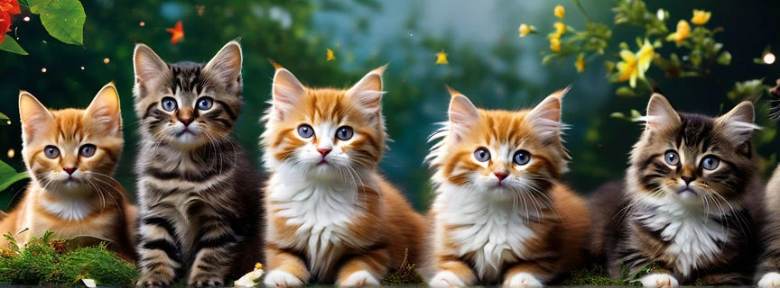
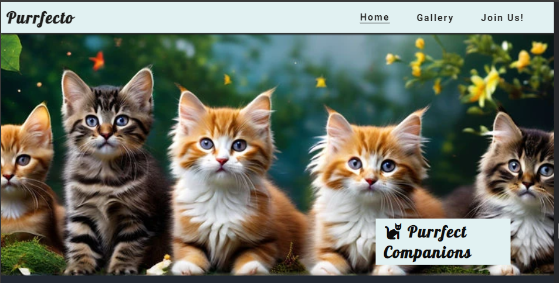

# Welcome to Purrfecto - the cat enthusiast' hub 
Purrfecto is an online hub where cat lovers (an dnot only) can share and enjoy images and videos of their beloved feline friends. 
The site aims to helping people of all ages across he world to connect and build-up a vibrant community.

The functionality of the hub allow to media files such as images and short videos and  
 

## Main features

The site has a standard structure with three pages  - Home, Gallery and Join-us.

All pages share a few common features such as:

* Navigation bar 
    - fully responsive and identical on each page
    - contains the Logo (Purrfecto)
        - the Logo is combination of two words - 'purr' and 'perfect', with an Italian spin.
    - a reponsive menu
        - the menu is compact on small displays and fully visible on larger ones    
        - the name of the active page is uderlined in the menu bar
        - the page names scale up when hovering over them while the cursor changes to pointer-style  
    - includes links to the Logo as well as to the Home, Gallery and Join-Us pages 

* Footer
    - consistent on each page   
    - contains icons/links to some of the major media-platforms (Facebook, Twitter, YouTube and Instagram)
        - the provided links open in new tabs
        - when hovering, the icons scale up and change the opacity   

### Home page
The Home page is page is fully responsive and contains the following sections: 
- hero section:
    - includes an eye-catching and soul-melting AI-generated image of kittens
    the  'Purrfecto' is overlayed over the landing image.
    
    
- additional content section includes four articles that presents general facts about cats formatted as unordered lists
- call to action section provides a link to the image gallery page, and portraits an AI-generated collage of cats as a preview
- the last section contains an embedded Google map of the Ainoshima island in Japan which is pretty famous for its stray cat population. A link to a dedicated Wikipedia article is also provided

### Gallery page
- The Gallery contains media content in form of image sent by the users. 
- The media files are inserted into reusable card objects thta provide statistics functionality such as send-likes and download options. The statistics (number of views and downloads) will be used for ranking the content.
- The page uses a masonry layout to create visually pleasent display of cards of different extents.   

### Join-Us page
- The page contains a form providing the users with the options for registering to the hub via name and valid email address. Providing a valid email adress is mandatory for registration. 
- A group of radio buttons has been included in the form for retrieveing information on how people are finding the website, either from media platforms, personal contacts or via other channels. The survey will help optimizing the media marketing.
- Functionality for uploading media files (with certain restrictions for file format and size) is also provided. 
- After submitting the regsitration form, a confirmation massage is provided in a new tab. 

## Testing

The site functionality has been tested with regard to (1) structural  

 /* Convert the default value of root font-size from 16 to 10 px 
        to use base 10 for calculations */

Known issues:
- email validation: not possible to check for valid domain. I tried to use the regex syntax according to https://regexr.com/, but is still possible to submit email without a valid domain (e.g., name@domain)

    ###

    ###